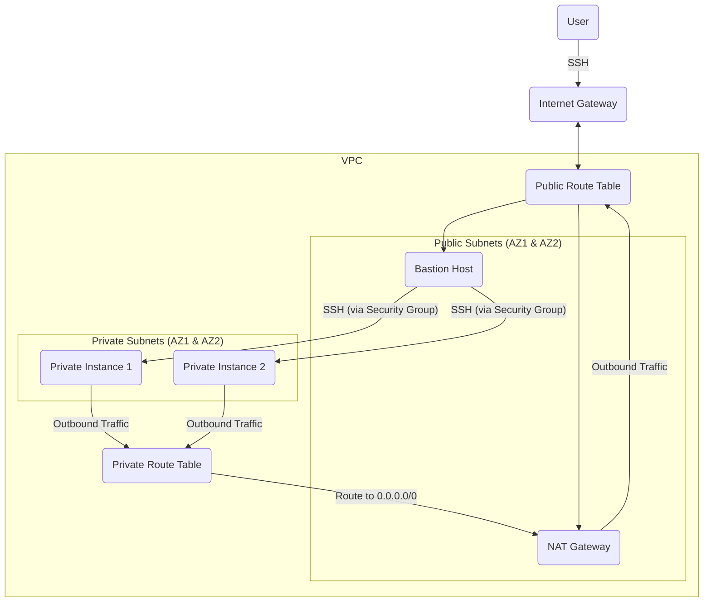

# Terraform AWS Infrastructure

This project contains Terraform code to deploy a basic networking infrastructure on AWS for a Kubernetes cluster.

## Deployed Resources

- **VPC**: A dedicated Virtual Private Cloud.
- **Subnets**:
  - 2 Public Subnets across two Availability Zones.
  - 2 Private Subnets across two Availability Zones.
- **Networking**:
  - **Internet Gateway**: Allows internet access to and from the public subnets.
  - **NAT Gateway**: Allows instances in the private subnets to access the internet.
  - **Route Tables**: Separate route tables for public and private subnets to control traffic flow.
- **Security**:
  - **Bastion Host**: An EC2 instance in a public subnet to provide secure SSH access to instances in private subnets.
  - **Security Groups**:
    - `bastion-sg`: Allows SSH access to the bastion from the internet.
    - `private-sg`: Allows SSH access from the bastion host to instances in the private subnets.
  - **Network ACLs**:
    - `public-nacl`: A network ACL for the public subnets.
    - `private-nacl`: A network ACL for the private subnets.

## Infrastructure Diagram



## Usage

1. **Prerequisites**:
   - Install [Terraform](https://learn.hashicorp.com/tutorials/terraform/install-cli).
   - Configure your AWS credentials.
   - Generate an SSH key pair. You will need to provide the public key to Terraform.

2. **Initialize Terraform**:
   ```bash
   terraform init
   ```

3. **Plan**:
   ```bash
   terraform plan
   ```

4. **Apply**:
   ```bash
   terraform apply
   ```